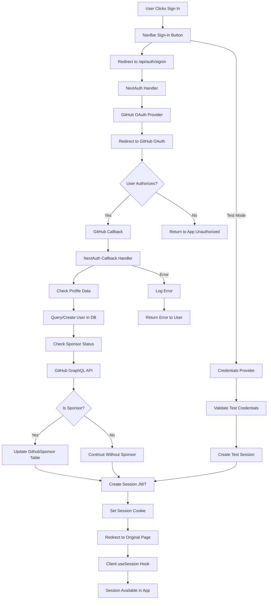

# GitHub OAuth Authentication Flow

## Overview
Complete authentication flow using NextAuth.js with GitHub OAuth provider, including sponsor verification and session management.

## Trigger Points
- User clicks "Sign in with GitHub" button
- Protected route access requiring authentication
- Session refresh/validation

## Flow Diagram


## Key Components
- **File**: `app/api/auth/[...nextauth]/route.ts` - NextAuth configuration and handlers
- **File**: `components/NavBar.tsx` - Sign-in UI component
- **File**: `components/NextAuthProvider.tsx` - Session provider wrapper
- **Function**: `checkUserSponsorStatus()` - Verifies GitHub sponsor status
- **Function**: `authOptions` - NextAuth configuration object
- **Database**: `prisma.user` - User persistence
- **Database**: `prisma.githubSponsor` - Sponsor tracking

## Data Flow
1. Input: GitHub OAuth response with profile data
   ```typescript
   {
     login: string,
     name?: string,
     email?: string,
     avatar_url?: string,
     id: string
   }
   ```
2. Transformations:
   - Profile mapped to User model
   - Sponsor status checked via GraphQL
   - Session JWT created
3. Output: Session object
   ```typescript
   {
     user: {
       id: string,
       username: string,
       fullName?: string,
       isSponsor?: boolean,
       email?: string,
       image?: string
     },
     expires: string
   }
   ```

## Error Scenarios
- GitHub OAuth fails or is rejected
- Database connection fails during user creation
- GitHub GraphQL API timeout for sponsor check
- Invalid test credentials provided
- Session token expiration

## Dependencies
- GitHub OAuth App (client ID & secret)
- GitHub Sponsors GraphQL API
- PostgreSQL database via Prisma
- NextAuth.js library
- JWT for session management