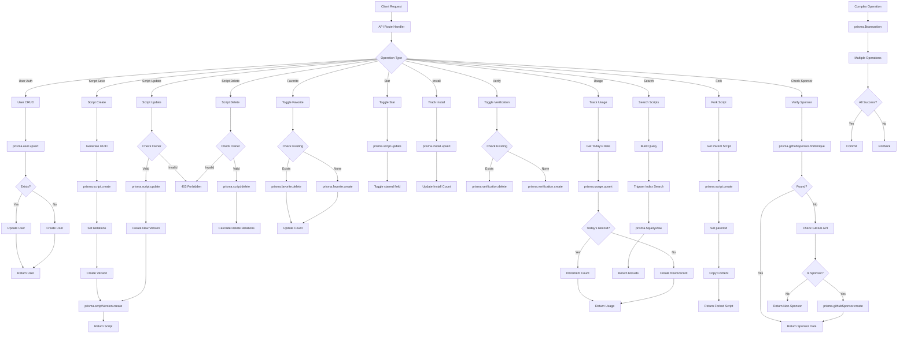

# Database CRUD Operations Flow

## Overview
Complete database operations flow using Prisma ORM with PostgreSQL, covering all CRUD operations for scripts, users, and related entities.

## Trigger Points
- User authentication creates/updates user records
- Script generation creates script records
- User interactions (favorite, star, install, verify)
- Usage tracking on generation
- Script forking and versioning

## Flow Diagram

## Key Components
- **File**: `lib/prisma.ts` - Prisma client singleton
- **File**: `prisma/schema.prisma` - Database schema
- **Models**: User, Script, ScriptVersion, Favorite, Install, Verification, Usage, GithubSponsor
- **Indexes**: Trigram index on script content for search
- **Relations**: One-to-many, many-to-many relationships

## Data Flow
1. Input: API request with operation parameters
2. Transformations:
   - Request validation
   - Authorization checks
   - Database query construction
   - Relation management
3. Output: Database response or error

## Error Scenarios
- Unique constraint violations
- Foreign key constraint failures
- Connection pool exhaustion
- Transaction rollbacks
- Authorization failures
- Database connection timeouts

## Dependencies
- PostgreSQL (Neon hosted)
- Prisma ORM
- Connection pooling via Neon
- Database migrations