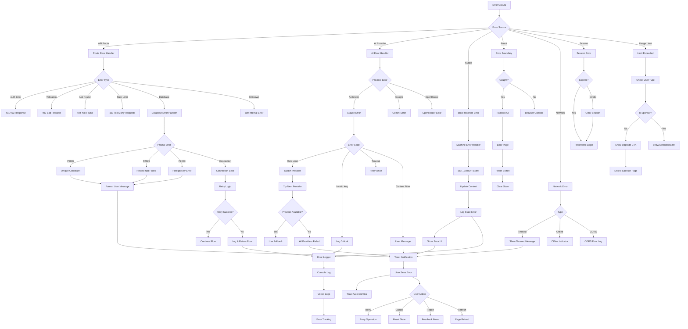

# Error Handling Cascade Flow

## Overview
Comprehensive error handling flow showing how errors propagate through the application layers and how they're caught, logged, and presented to users.

## Trigger Points
- API request failures
- Database operation errors
- AI provider timeouts/failures
- Authentication errors
- Validation failures
- Network disconnections
- Rate limit violations

## Flow Diagram

## Key Components
- **File**: `app/api/[...]/route.ts` - API error handlers
- **File**: `components/ScriptGenerationMachine.ts` - State machine error handling
- **File**: `lib/apiService.ts` - Client-side error handling
- **File**: `lib/ai-gateway.ts` - AI provider error handling
- **Function**: `handlePrismaError()` - Database error formatting
- **Function**: `logInteraction()` - Error logging
- **Component**: Error boundaries for React components
- **Library**: React Hot Toast for user notifications

## Data Flow
1. Input: Error object with stack trace
2. Transformations:
   - Error classification
   - User-friendly message generation
   - Logging with context
   - Recovery action determination
3. Output: User notification, logs, recovery options

## Error Scenarios
- **Authentication**: Expired sessions, invalid tokens
- **Authorization**: Insufficient permissions
- **Validation**: Invalid input data
- **Database**: Connection failures, constraint violations
- **AI Providers**: API limits, timeouts, content filters
- **Network**: Offline, timeouts, CORS issues
- **State Machine**: Invalid transitions, corrupted context
- **Rate Limiting**: Daily usage exceeded

## Dependencies
- Error boundaries (React 18+)
- Toast notification system
- Vercel logging infrastructure
- Prisma error types
- AI SDK error handling
- XState error events