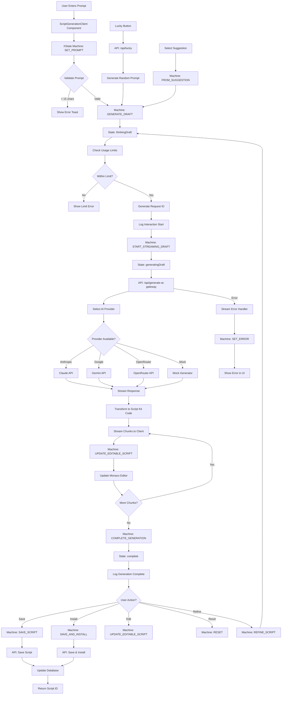

# AI Script Generation Flow

## Overview
Complete flow for generating Script Kit automation scripts using AI, from user prompt to saved script with streaming responses.

## Trigger Points
- User enters prompt and clicks "Generate" button
- User clicks "I'm Feeling Lucky" for random generation
- User selects a suggestion from carousel
- User refines existing script

## Flow Diagram

## Key Components
- **File**: `components/ScriptGenerationClient.tsx` - Main UI component
- **File**: `components/ScriptGenerationMachine.ts` - XState state machine
- **File**: `app/api/generate-ai-gateway/route.ts` - Generation endpoint
- **File**: `lib/ai-gateway.ts` - AI provider configuration
- **File**: `lib/apiService.ts` - Client API functions
- **Function**: `generateDraftWithProvider()` - Provider routing logic
- **Function**: `streamToString()` - Stream transformation

## Data Flow
1. Input: User prompt (string, min 15 chars)
2. Transformations:
   - Prompt enhanced with system context
   - Script Kit API docs injected
   - AI model generates TypeScript code
   - Response streamed and formatted
3. Output: TypeScript script with Script Kit imports

## Error Scenarios
- AI provider API failure
- Rate limit exceeded (24/100 daily limit)
- Network timeout during streaming
- Invalid/malformed AI response
- Database save failure
- Session expired during generation

## Dependencies
- Anthropic Claude API
- Google Gemini API
- OpenRouter API (fallback)
- PostgreSQL for script storage
- Monaco Editor for code display
- XState for state management