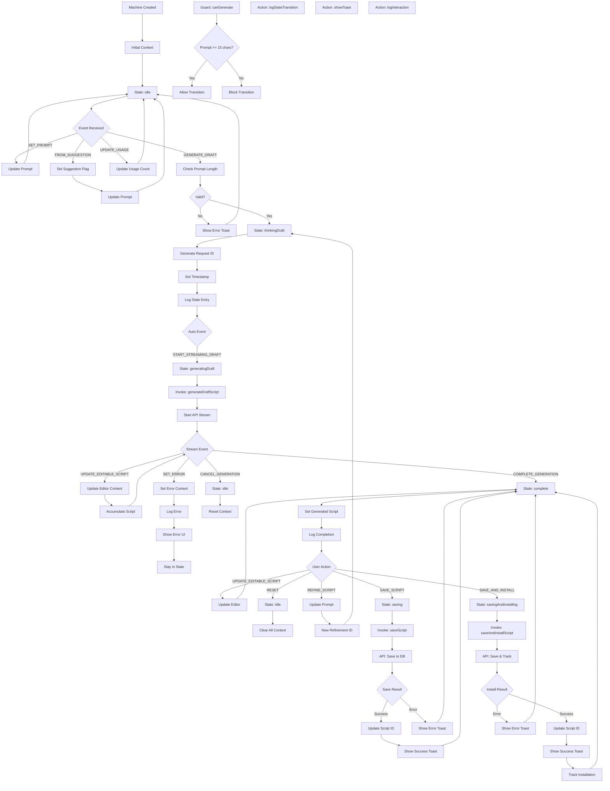

# XState Script Generation State Machine Flow

## Overview
Complete state machine flow managing the script generation lifecycle, from idle to completion with all transitions and side effects.

## Trigger Points
- Component mount initializes machine
- User interactions trigger events
- API responses trigger transitions
- Error conditions trigger error states

## Flow Diagram


## Key Components
- **File**: `components/ScriptGenerationMachine.ts` - State machine definition
- **States**: idle, thinkingDraft, generatingDraft, complete, saving, savingAndInstalling
- **Events**: SET_PROMPT, GENERATE_DRAFT, UPDATE_EDITABLE_SCRIPT, COMPLETE_GENERATION, SAVE_SCRIPT, RESET
- **Guards**: canGenerate (prompt validation)
- **Actions**: assign, logStateTransition, toast notifications
- **Services**: generateDraftScript, saveScript, saveAndInstallScript

## Data Flow
1. Input: Machine Context
   ```typescript
   {
     prompt: string,
     editableScript: string,
     generatedScript: string | null,
     error: string | null,
     usageCount: number,
     usageLimit: number,
     requestId: string | null,
     scriptId: string | null
   }
   ```
2. Transformations:
   - Context updates via assign actions
   - State transitions trigger side effects
   - Services invoke async operations
3. Output: Updated context and state

## Error Scenarios
- Invalid prompt (< 15 characters)
- Generation service failure
- Save service failure
- Network disconnection during streaming
- Context corruption
- Invalid state transition

## Dependencies
- XState v5 library
- React integration via @xstate/react
- Toast notifications (react-hot-toast)
- API service functions
- Interaction logger