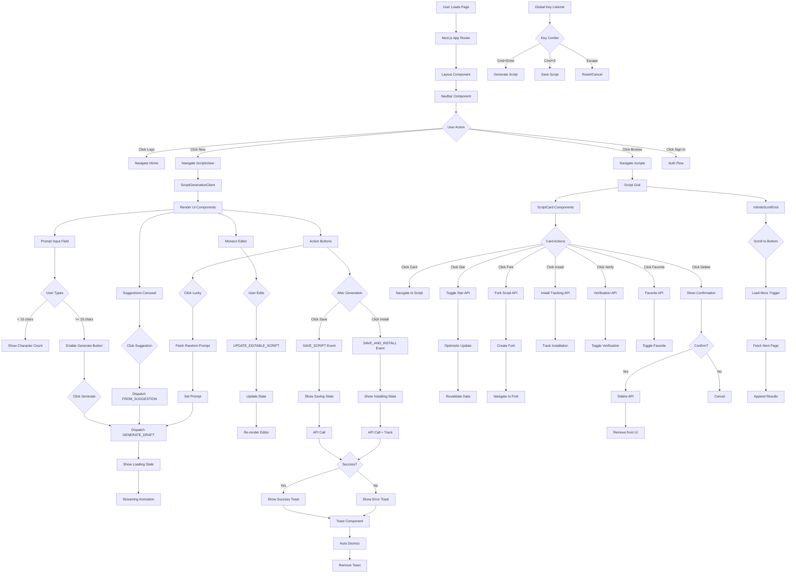

# User Interaction UI Flow

## Overview
Complete user interaction flow covering all UI components and their event handlers, from navigation to script manipulation.

## Trigger Points
- Page navigation clicks
- Button interactions (Generate, Save, Install, Fork, etc.)
- Form submissions
- Keyboard shortcuts
- Monaco editor changes
- Toast notifications

## Flow Diagram

## Key Components
- **File**: `components/ScriptGenerationClient.tsx` - Main generation UI
- **File**: `components/NavBar.tsx` - Navigation component
- **File**: `components/ScriptCard.tsx` - Script display cards
- **File**: `components/InfiniteScrollGrid.tsx` - Infinite scroll container
- **File**: `components/FavoriteButtonClient.tsx` - Favorite interaction
- **File**: `components/InstallButtonClient.tsx` - Install tracking
- **File**: `components/DeleteButtonClient.tsx` - Delete with confirmation
- **File**: `components/ScriptSuggestions.tsx` - Suggestion carousel
- **Function**: Event handlers (onClick, onChange, onSubmit)

## Data Flow
1. Input: User interactions (clicks, keyboard, scroll)
2. Transformations:
   - Event handling
   - State updates (React/XState)
   - API calls
   - Optimistic UI updates
3. Output: UI re-renders, navigation, toasts

## Error Scenarios
- Network failures on API calls
- Session expiration during interaction
- Optimistic update rollback
- Rate limit exceeded
- Invalid user input
- Component unmount during async operations

## Dependencies
- React event system
- Next.js router
- XState for complex state
- React Hot Toast for notifications
- SWR for data fetching
- Framer Motion for animations